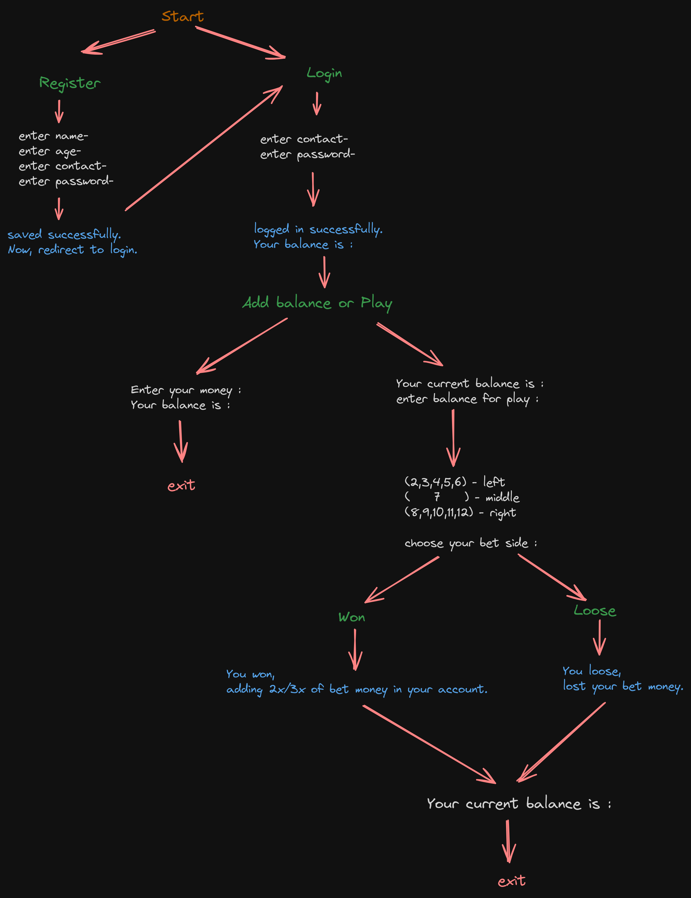
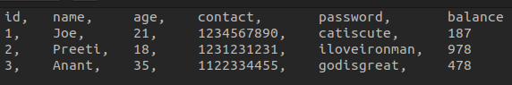

# 7Glass

## Description
This is a game. where user choose the option and computer also randomly choose the option. if both are same then user wins. otherwise user loose.
This game is a practice project, code in python and sqlite3.
I am reacently learnt about mysql and sql database. so it is a practice project.

## Installation
Step-by-step instructions on how to get started.

```bash
# Clone the repository
git clone https://github.com/agtiwari7/7Glass.git

# Navigate to the project directory
cd 7Glass

# Install dependencies
pip install bcrypt

# Run the game
python main.py
```

## Algorithm
<p align="center"></p>

## Users Example
<p align="center"></p>

## Rules to Play : 